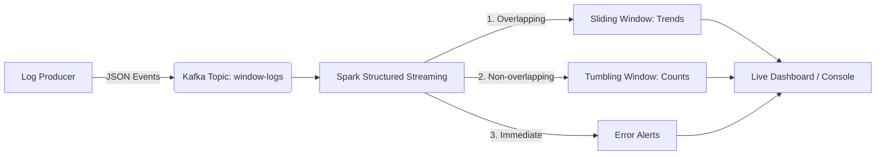

# 📝 Technical Report: Window-based Stream Processing Algorithm

**Topic:** Real-time Distributed Log Analytics using Windowing Functions  
**Technologies:** Apache Kafka, PySpark Structured Streaming, Docker  
**Status:** ✅ Fully Implemented and Verified

---

## 1. Overview
This system implements a high-throughput log analytics pipeline designed to process millions of events using **Window-based Stream Processing Algorithms**. The goal is to transform raw, unstructured log data into actionable insights (aggregations, trends, and alerts) with low latency.

---

## 2. Core Windowing Algorithms

### A. Tumbling Window (Fixed-size, Non-overlapping)
*   **Window Size:** 1 Minute
*   **Logic:** Every event belongs to exactly one window.
*   **Implementation:** `groupBy(window(col("event_time"), "1 minute"), ...)`
*   **Use Case:** **Discrete Aggregations**. Used for calculating the exact number of logs per (Level, Service) in fixed intervals. 
*   **Mathematical Representation:**  
    $W_i = [t_{start} + i \times size, t_{start} + (i+1) \times size)$

### B. Sliding Window (Fixed-size, Overlapping)
*   **Window Size:** 2 Minutes
*   **Slide Interval:** 30 Seconds
*   **Logic:** Windows overlap. An event can trigger updates in multiple concurrent windows.
*   **Implementation:** `groupBy(window(col("event_time"), "2 minutes", "30 seconds"), ...)`
*   **Use Case:** **Rolling Trends**. Used for calculating the moving average of latency and the "Error Rate %". It provides a smoother view of system health and catches spikes faster than tumbling windows.
*   **Mathematical Representation:**  
    A new window starts every `slide` interval, but each lasts for `size` duration.

---

## 3. Real-time Alerting Mechanism

Unlike windowing (which waits for a period to end), the **Alerting Engine** uses a per-batch processing model (`foreachBatch`).
*   **Filter Logic:** `col("level") == "ERROR"`
*   **Action:** As soon as an Error log is detected in a micro-batch (~5 seconds), an alert is printed to the console.
*   **Benefit:** Zero-wait notification for critical system failures.

---

## 4. Handling Late Data (Watermarking)

In distributed systems, data can arrive out of order or late due to network lag.
*   **Solution:** **Watermarking** (set to 30 seconds).
*   **Mechanism:** Spark tracks the "event time" and ignores any data that arrives more than 30 seconds after the current max timestamp.
*   **Result:** Prevents the state from growing infinitely and ensures window results are finalized accurately.

---

## 5. System Architecture

---

## 6. How to Interpret the Output

### Tumbling Window Console Table
| Window Start | Level | Service | Count | Avg Latency |
|:---|:---|:---|:---|:---|
| 14:01:00 | ERROR | PaymentService | 12 | 845.2ms |
| 14:01:00 | INFO | UserService | 85 | 42.1ms |
*Interpretation: In that specific minute, PaymentService was failing heavily with high latency.*

### Sliding Window Console Table
| Window Start | Service | Events | AvgMs | Err % | Bar |
|:---|:---|:---|:---|:---|:---|
| 14:01:30 | AuthService | 150 | 65.2 | 4.5% | ▓ |
*Interpretation: Over the last 2 minutes (updated at 14:01:30), 4.5% of Auth requests failed.*

---

## 7. Fault Tolerance Primitives
The system is built to survive crashes using:
1.  **Checkpoints**: Offsets are saved to `/tmp/checkpoints/` so Spark can resume exactly where it left off.
2.  **Watermarking**: Handles network delays.
3.  **Idempotent Sinks**: Ensures data isn't duplicated if a batch is re-run.
